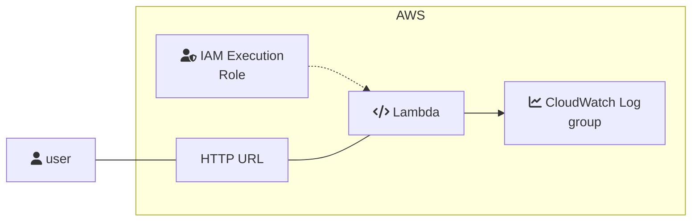

#  simple-codecatalyst-terraform
This is a repository containing some simple terraform. It deploys a simple python lambda with http url.

```mermaid
flowchart LR
    a[fa:fa-user user]---e
    subgraph AWS
        c[fas:fa-user-shield IAM Execution<br />Role]-.->b[fas:fa-code Lambda]
        b-->d[fas:fa-chart-line CloudWatch Log<br />group]
        e[HTTP URL]---b
    end
```